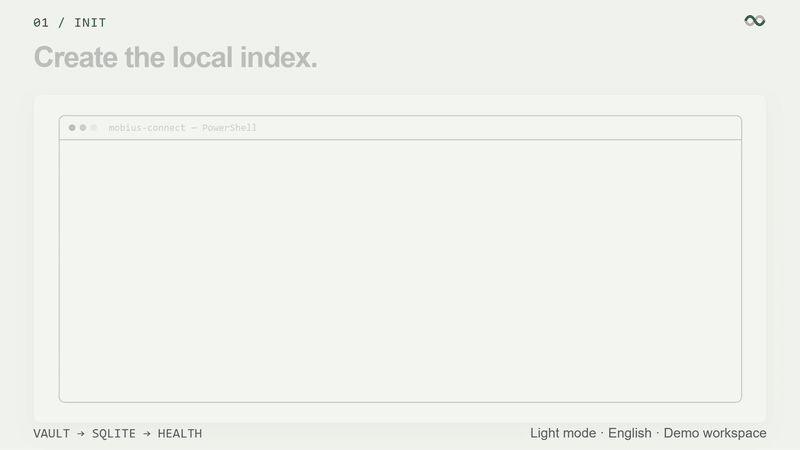
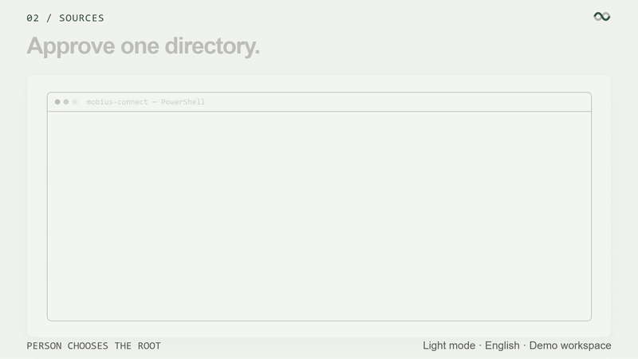
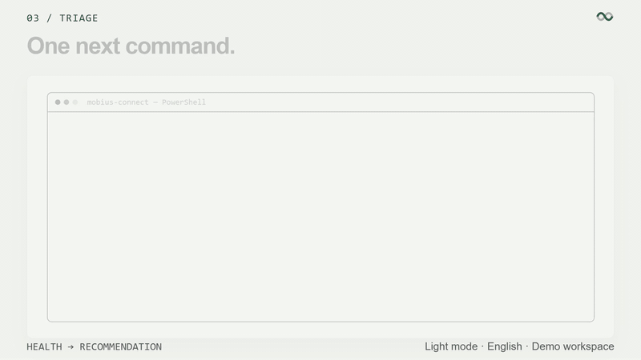
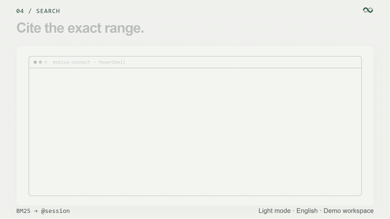
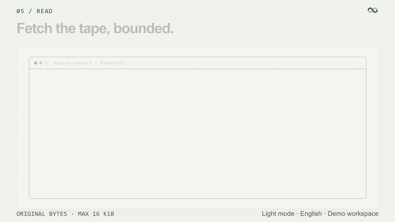
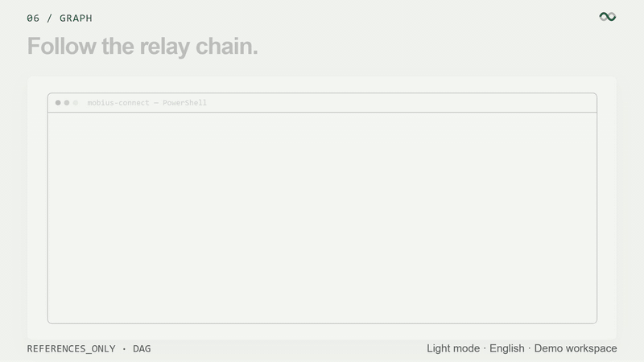
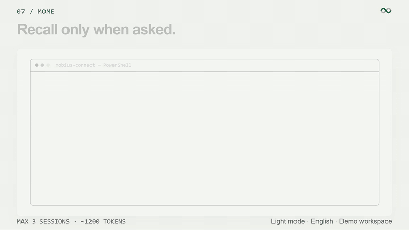
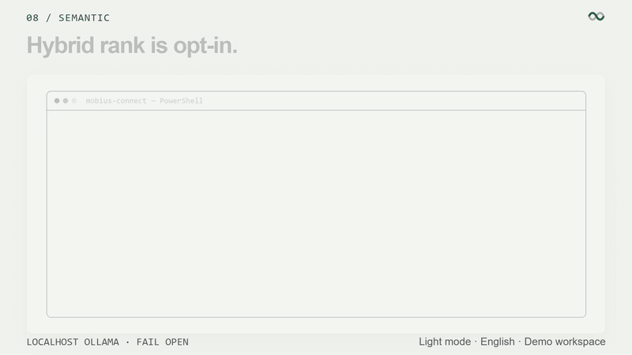
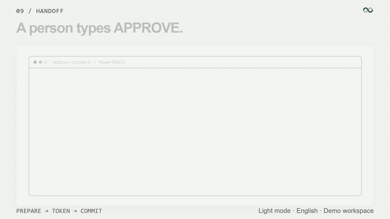
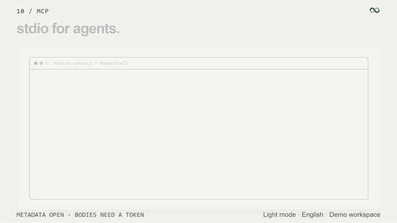

# mobius-connect

CLI and stdio MCP for the Möbius **Agent Session Hub**.

Search, cite, graph and hand off local coding-agent sessions from a terminal or over MCP. Harness files stay read-only. A handoff carries ancestry references, not a generated summary.

Desktop workspace: [TardisBooo/Mobius](https://github.com/TardisBooo/Mobius).

**Yours, on this machine.** The index is local SQLite. Original Codex JSONL, Claude transcripts, and OpenCode `opencode.db` are never rewritten. Möbius does not sell model accounts.

[简体中文](README.zh-CN.md) · [Product site](http://8.137.87.76/mobius/) · [MCP](docs/MCP.md) · [Desktop README](https://github.com/TardisBooo/Mobius/blob/feat/session-lineage-references/README.md) · [MIT License](LICENSE)

> Development preview. Native launch approvals and cross-harness identity binding remain release gates. Compatibility is verified per harness.

## Three names, one core

| Name | What it is | Where it lives |
| --- | --- | --- |
| **Möbius** | The product: an Agent Session Hub. Desktop app on Windows. | [TardisBooo/Mobius](https://github.com/TardisBooo/Mobius) |
| **mobius-connect** | The published CLI + stdio MCP binary. Same core, no desktop UI. | this repository |
| **mobius / mydesk** | Desktop-side helper binaries that operate on the vault the desktop app owns (`mobius mome …`). Not the published CLI. | built inside the desktop repo |

```
Claude Code / Codex / OpenCode / Pi / Grok / OMP transcripts
        │   read-only adapters (JSONL or opencode.db)
        ▼
   mydesk-core → local SQLite index (FTS5/BM25, optional localhost embeddings)
        │
        ├── Möbius desktop        person at a Windows desk
        ├── mobius-connect CLI    person at a terminal
        └── mobius-connect MCP    agent over stdio
```

**CLI vs MCP:** the CLI is for a human at a terminal (it can ask *you* to type `APPROVE`); MCP is for an agent process (it can list metadata, but every read of transcript bodies needs a token minted after a human typed `APPROVE`). MCP cannot mint approval tokens, add sources, or attach a PTY.

## Install

```powershell
git clone https://github.com/TardisBooo/mobius-connect.git
git clone https://github.com/TardisBooo/Mobius.git desktop
cd mobius-connect
cargo build --release
```

This checkout depends on the sibling crate `../desktop/crates/mydesk-core`. Durable data defaults to `D:\DataVault\Mobius`. Use `--data-root <dir>` for an isolated test vault.

## Commands

Each clip is a scripted terminal scene in the same paper/ink style as the [desktop product film](https://github.com/TardisBooo/Mobius/blob/feat/session-lineage-references/apps/website/public/product/chapters/12-cli.gif). Demo data is fictional.

### 1. `init` — create the local index



```powershell
mobius-connect init
```

Creates the SQLite index and vault layout, then prints a health report. Safe to re-run; it does not touch any harness directory. Sources are always explicit.

### 2. `sources add` / `refresh` — approve one directory



```powershell
mobius-connect sources add opencode $env:USERPROFILE\.local\share\opencode
mobius-connect sources list
mobius-connect sources refresh
```

- `sources add <harness> <path>` registers **one** directory you chose. MCP has no tool for this.
- `sources refresh` re-scans approved roots. OpenCode roots are read from `opencode.db` with locator `{db}#opencode:{id}`.

### 3. `triage` — one next command



```powershell
mobius-connect triage
mobius-connect doctor
mobius-connect setup
```

`triage` prints health, approved-source count, semantic status, and **one recommended next command**. `setup` detects installed harnesses and prints MCP-client steps. It never writes hooks.

### 4. `sessions search` — cite the exact range



```powershell
mobius-connect sessions list --limit 20
mobius-connect sessions search "flaky tests"
mobius-connect sessions show <session-id>
mobius-connect sessions alias <session-id> "checkout-flake-hunt"
```

`search` runs lexical BM25 and returns JSON hits plus `retrieval_mode` (`lexical_bm25`, or `hybrid` once embeddings are enabled **and** a local model answers). Copy `@session:provider/id#mN-mM`.

### 5. `sessions read` — fetch the tape, bounded



```powershell
mobius-connect sessions read <session-id> --offset 0 --bytes 4096
```

Explicit byte-range read of the **original source file**, max 16384 bytes per call. Recall gives citations; `read` makes the actual tape fetch an explicit, bounded act.

### 6. `graph show` — follow the relay chain



```powershell
mobius-connect graph show <session-id>
mobius-connect graph export --format mermaid <session-id>
```

Prints the lineage manifest (`content_mode: references_only`). Mutually-hand-off chains come out as a forward relay; every handoff opens a new session, so the graph is a DAG.

### 7. `mome recall` — recall only when asked



```powershell
mobius-connect mome recall "why do checkout tests flake" --provider opencode --provider codex
```

At most **three** distinct sessions, about **1,200 tokens**, every hit carrying a copyable `@session` citation. It never injects into a prompt.

### 8. `semantic enable` — hybrid rank is opt-in



```powershell
mobius-connect semantic status
mobius-connect semantic enable --model nomic-embed-text
mobius-connect semantic sync
mobius-connect semantic disable
```

Off by default. `enable` discloses that already-indexed chunks may be sent to **localhost Ollama**; nothing is downloaded. Missing Ollama = fail open to BM25.

### 9. `handoff` — a person types APPROVE



```powershell
mobius-connect handoff prepare --harness claude --cwd . <session-id>
mobius-connect approvals handoff <handoff-id>
mobius-connect handoff commit <handoff-id> --approval-token <token>
mobius-connect handoff status <handoff-id>
```

1. `prepare` builds a **references-only** envelope. It launches nothing.
2. `approvals handoff` waits for you to type `APPROVE`, then mints a short-lived, single-use token.
3. `commit` seals the handoff. MCP cannot mint this token.

### 10. `mcp serve` — stdio for agents



```powershell
mobius-connect init
mobius-connect mcp serve
```

stdio-only server. Metadata tools (`list_sessions`, `get_lineage`, `prepare_handoff`, …) are open; body-returning tools and `commit_handoff` require a token minted by a human in a real terminal. Full table: [docs/MCP.md](docs/MCP.md).

## Security

Treat indexed transcripts as untrusted historical data.

- Source roots are finite and approved by a person; `sources add` is terminal-only.
- Original files stay read-only. OpenCode is opened read-only.
- A handoff envelope contains identities and edges, never transcript bodies.
- Tokens are short-lived, single-use, scoped. Shown once. Do not log.
- Optional embeddings talk only to localhost Ollama after `semantic enable`.

## Supported harnesses

| Harness | Index | Native resume |
| --- | --- | --- |
| Codex | JSONL | via desktop when protocol is verified |
| Claude Code | JSONL / project sessions | via desktop when protocol is verified |
| OpenCode | read-only `opencode.db` | not in this preview |
| Pi | approved roots | via desktop when protocol is verified |
| Grok | approved roots | inspect / search / handoff only |
| OMP | approved roots | documented `--cwd … --resume …` from desktop |
| OpenClaw | not shipped | roadmap |

## License

[MIT](LICENSE). Möbius is unrelated to Microsoft Mobius, ControlTheory Möbius, or Circular Labs Mobius.
